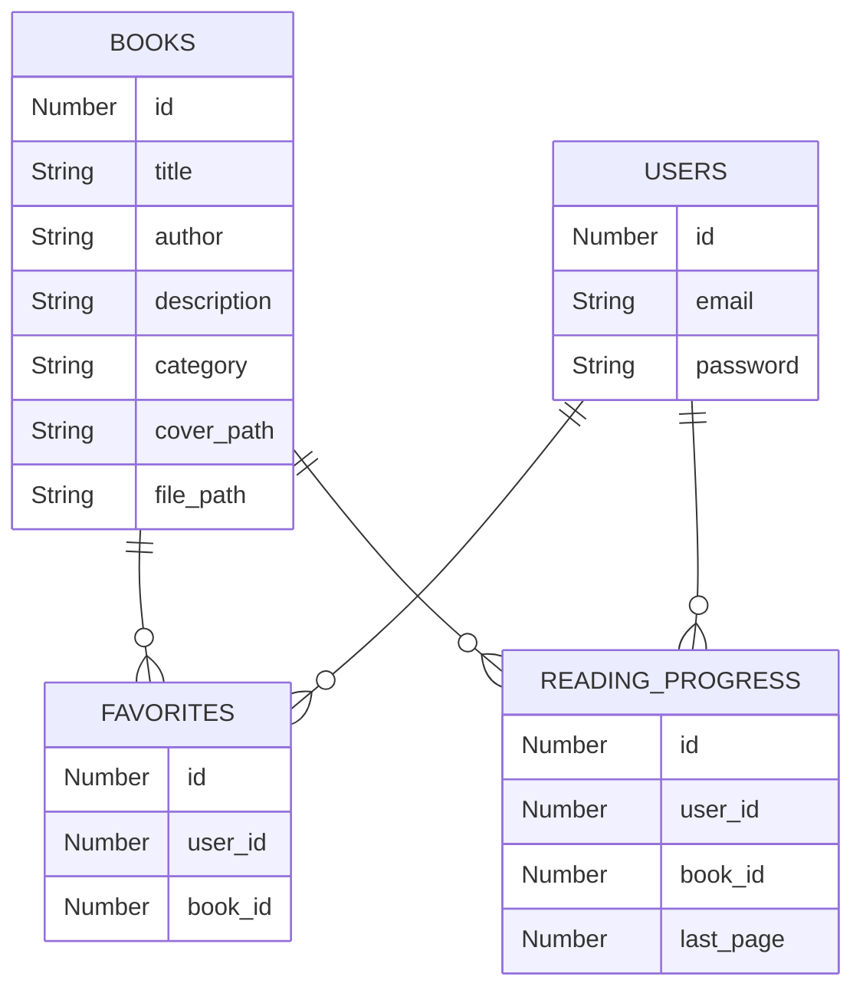
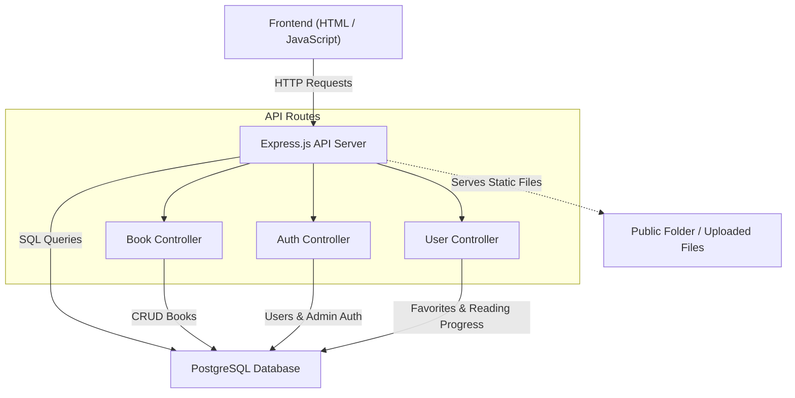

# Documentation for Library Website Codebase

This documentation details the structure, functionality, and API endpoints of the digital library web application. The project provides a platform to browse, read, and manage books, with role-based features for users and admins.

---

## 📦 `package.json`

The `package.json` file manages project dependencies, scripts, and metadata.

- **Scripts**:
  - `start`: Runs the server (`node server.js`)
  - `dev`: Runs the server with auto-reload (`nodemon server.js`)
- **Dependencies**:
  - `express`, `dotenv`, `bcryptjs`, `jsonwebtoken`, `multer`, `pg`
- **Dev Dependencies**:
  - `nodemon`
- **Type**:  
  Uses ECMAScript Modules (`"type": "module"`).

```json
{
  "name": "library-website",
  "version": "1.0.0",
  "main": "server.js",
  "type": "module",
  "scripts": {
    "start": "node server.js",
    "dev": "nodemon server.js"
  },
  "dependencies": {
    "bcryptjs": "^3.0.3",
    "dotenv": "^16.3.1",
    "express": "^4.19.2",
    "jsonwebtoken": "^9.0.2",
    "multer": "1.4.5-lts.1",
    "pg": "^8.11.1"
  },
  "devDependencies": {
    "nodemon": "^3.1.0"
  }
}
```

---

## 🛠️ `.env`

This file stores environment variables for database and JWT configuration.

| Variable       | Purpose                                  |
| -------------- | ---------------------------------------- |
| DB_USER        | Database username                        |
| DB_PASSWORD    | Database password                        |
| DB_HOST        | Database host (usually `localhost`)      |
| DB_NAME        | Name of the PostgreSQL database          |
| DB_PORT        | Database port (default PostgreSQL: 5432) |
| JWT_SECRET     | Secret used for JWT token signing        |
| JWT_EXPIRES_IN | Token expiration duration (e.g., `7d`)   |

Example:

```
DB_USER=postgres
DB_PASSWORD=your_password
DB_HOST=localhost
DB_NAME=library
DB_PORT=5432
JWT_SECRET=your_jwt_secret
JWT_EXPIRES_IN=7d
```

---

## 🚀 `server.js`

This is the main entry point for the backend server.

- **Loads environment variables**
- **Initializes Express server**
- **Serves static files** (from `/public` and `/src/uploads`)
- **Enables JSON and URL-encoded middleware**
- **Logs requests in non-production mode**
- **Mounts API routes**:
  - `/api/books` → Book CRUD operations
  - `/api/auth` → Authentication
  - `/api/user` → User-specific features

**Starts server** on port 3000.

```js
import path from "path";
import express from "express";
import dotenv from "dotenv";
import bookRoutes from "./src/routes/bookRoutes.js";
import authRoutes from "./src/routes/authRoutes.js";
import userRoutes from "./src/routes/userRoutes.js";
dotenv.config();

const app = express();
const ROOT = process.cwd();
const PUBLIC_PATH = path.join(ROOT, "public");
const UPLOADS_PATH = path.join(ROOT, "src", "uploads");

// Middleware
app.use(express.json());
app.use(express.urlencoded({ extended: true }));

// Static files
app.use(express.static(PUBLIC_PATH));
app.use("/uploads", express.static(UPLOADS_PATH));

// Debug request logger (development only)
if (process.env.NODE_ENV !== "production") {
  app.use((req, res, next) => {
    console.log("REQ:", req.method, req.path);
    next();
  });
}

// API routes
app.use("/api/books", bookRoutes);
app.use("/api/auth", authRoutes);
app.use("/api/user", userRoutes);

// Start server
app.listen(3000, () => {
  console.log("Server running on port 3000");
});
```

---

## 🗄️ `db.js`

Handles PostgreSQL connection using environment variables.

- Uses `pg`'s Pool for connection pooling.
- Logs successful connection or error.

```js
import pkg from "pg";
import dotenv from "dotenv";
dotenv.config();

const { Pool } = pkg;

export const db = new Pool({
  user: process.env.DB_USER,
  host: process.env.DB_HOST,
  database: process.env.DB_NAME,
  password: String(process.env.DB_PASSWORD),
  port: Number(process.env.DB_PORT),
});

db.connect()
  .then(() => console.log("✅ Connected to PostgreSQL"))
  .catch((err) => console.error("❌ Database Error:", err));
```

---

## 🔐 `authMiddleware.js`

Contains Express middleware for authentication and authorization.

- **`authenticate`:**

  - Verifies JWT token in the `Authorization` header.
  - Sets `req.user` if valid.
  - Returns 401 if missing/invalid.

- **`requireAdmin`:**

  - Checks `req.user.role` is `"admin"`.
  - Returns 403 if not.

- **`requireUser`:**
  - Checks `req.user.role` is `"user"`.
  - Returns 403 if not.

```js
import jwt from "jsonwebtoken";

export const authenticate = (req, res, next) => {
  const authHeader = req.headers.authorization;
  if (!authHeader?.startsWith("Bearer ")) {
    return res.status(401).json({ message: "No token provided" });
  }
  const token = authHeader.split(" ")[1];
  try {
    const decoded = jwt.verify(token, process.env.JWT_SECRET);
    req.user = decoded;
    next();
  } catch (err) {
    return res.status(401).json({ message: "Invalid or expired token" });
  }
};

export const requireAdmin = (req, res, next) => {
  if (!req.user || req.user.role !== "admin") {
    return res.status(403).json({ message: "Admin only" });
  }
  next();
};

export const requireUser = (req, res, next) => {
  if (!req.user || req.user.role !== "user") {
    return res.status(403).json({ message: "User only" });
  }
  next();
};
```

---

## 📚 `bookController.js`

Handles all book-related backend logic.

- **Get all books**
- **Get a single book**
- **Add a new book** (with file upload)
- **Update book info**
- **Delete a book** (removes files as well)

Uses a helper `safeUnlink` to remove files from filesystem.

### Database Table Relationships



---

## 📖 Book API Endpoints

### Get All Books (`GET /api/books`)

Returns a list of all books.

```api
{
  "title": "Get All Books",
  "description": "Retrieves all books in the library",
  "method": "GET",
  "baseUrl": "http://localhost:3000/api",
  "endpoint": "/books",
  "headers": [],
  "queryParams": [],
  "pathParams": [],
  "bodyType": "none",
  "requestBody": "",
  "responses": {
    "200": {
      "description": "Array of books",
      "body": "[{ \"id\": 1, \"title\": \"Book Title\", \"author\": \"Author Name\", \"description\": \"...\", \"category\": \"Fiction\", \"cover_path\": \"covers/cover1.jpg\", \"file_path\": \"books/book1.pdf\" }]"
    }
  }
}
```

### Get Book By ID (`GET /api/books/:id`)

Returns details for a single book.

```api
{
  "title": "Get Book By ID",
  "description": "Retrieves a book by its ID",
  "method": "GET",
  "baseUrl": "http://localhost:3000/api",
  "endpoint": "/books/{id}",
  "headers": [],
  "queryParams": [],
  "pathParams": [
    {
      "key": "id",
      "value": "Book ID",
      "required": true
    }
  ],
  "bodyType": "none",
  "requestBody": "",
  "responses": {
    "200": {
      "description": "Book data",
      "body": "{ \"id\": 1, \"title\": \"Book Title\", \"author\": \"Author Name\", \"description\": \"...\", \"category\": \"Fiction\", \"cover_path\": \"covers/cover1.jpg\", \"file_path\": \"books/book1.pdf\" }"
    },
    "404": {
      "description": "Not Found",
      "body": "{ \"message\": \"Book not found\" }"
    }
  }
}
```

### Add a Book (`POST /api/books/add`)

**Admin only.** Adds a new book. Requires file uploads for book PDF (and optional cover).

```api
{
  "title": "Add Book",
  "description": "Adds a new book (admin only)",
  "method": "POST",
  "baseUrl": "http://localhost:3000/api",
  "endpoint": "/books/add",
  "headers": [
    {
      "key": "Authorization",
      "value": "Bearer <admin_token>",
      "required": true
    }
  ],
  "queryParams": [],
  "pathParams": [],
  "bodyType": "form",
  "formData": [
    { "key": "title", "value": "Book title", "required": true },
    { "key": "author", "value": "Author name", "required": true },
    { "key": "description", "value": "Description", "required": true },
    { "key": "category", "value": "Category", "required": false },
    { "key": "cover", "value": "Cover image file", "required": false },
    { "key": "book", "value": "Book PDF file", "required": true }
  ],
  "responses": {
    "201": {
      "description": "Book added",
      "body": "{ \"message\": \"Book added\", \"book\": { \"id\": 2, ... } }"
    },
    "400": {
      "description": "Missing field",
      "body": "{ \"message\": \"title, author, description are required\" }"
    }
  }
}
```

### Update Book (`PUT /api/books/:id`)

**Admin only.** Updates an existing book.

```api
{
  "title": "Update Book",
  "description": "Updates a book (admin only)",
  "method": "PUT",
  "baseUrl": "http://localhost:3000/api",
  "endpoint": "/books/{id}",
  "headers": [
    {
      "key": "Authorization",
      "value": "Bearer <admin_token>",
      "required": true
    }
  ],
  "queryParams": [],
  "pathParams": [
    { "key": "id", "value": "Book ID", "required": true }
  ],
  "bodyType": "json",
  "requestBody": "{ \"title\": \"New Title\", \"author\": \"New Author\", \"description\": \"...\", \"category\": \"Category\" }",
  "responses": {
    "200": {
      "description": "Success",
      "body": "{ \"message\": \"Book updated\", \"book\": { \"id\": 1, ... } }"
    },
    "404": {
      "description": "Not Found",
      "body": "{ \"message\": \"Book not found\" }"
    }
  }
}
```

### Delete Book (`DELETE /api/books/:id`)

**Admin only.** Deletes a book and its files.

```api
{
  "title": "Delete Book",
  "description": "Deletes a book (admin only)",
  "method": "DELETE",
  "baseUrl": "http://localhost:3000/api",
  "endpoint": "/books/{id}",
  "headers": [
    {
      "key": "Authorization",
      "value": "Bearer <admin_token>",
      "required": true
    }
  ],
  "pathParams": [
    { "key": "id", "value": "Book ID", "required": true }
  ],
  "bodyType": "none",
  "requestBody": "",
  "responses": {
    "200": {
      "description": "Success",
      "body": "{ \"message\": \"Book deleted\" }"
    },
    "404": {
      "description": "Not Found",
      "body": "{ \"message\": \"Book not found\" }"
    }
  }
}
```

---

## 👤 `authController.js`

Handles user and admin authentication.

- **Admin login** (username/password)
- **User register** (email/password)
- **User login** (email/password)
- Uses bcrypt for password hashing, JWT for issuing tokens.

### Admin Login (`POST /api/auth/admin/login`)

```api
{
  "title": "Admin Login",
  "description": "Authenticate admin and return a JWT token.",
  "method": "POST",
  "baseUrl": "http://localhost:3000/api",
  "endpoint": "/auth/admin/login",
  "headers": [],
  "bodyType": "json",
  "requestBody": "{ \"username\": \"admin\", \"password\": \"secret\" }",
  "responses": {
    "200": {
      "description": "Success",
      "body": "{ \"token\": \"...jwt...\" }"
    },
    "400": {
      "description": "Invalid credentials",
      "body": "{ \"message\": \"Invalid username\" }"
    }
  }
}
```

### User Register (`POST /api/auth/user/register`)

```api
{
  "title": "User Register",
  "description": "Register a new user and return a JWT token.",
  "method": "POST",
  "baseUrl": "http://localhost:3000/api",
  "endpoint": "/auth/user/register",
  "headers": [],
  "bodyType": "json",
  "requestBody": "{ \"email\": \"test@mail.com\", \"password\": \"mypassword\" }",
  "responses": {
    "201": {
      "description": "User created",
      "body": "{ \"token\": \"...jwt...\" }"
    },
    "400": {
      "description": "Email exists",
      "body": "{ \"message\": \"Email already registered\" }"
    }
  }
}
```

### User Login (`POST /api/auth/user/login`)

```api
{
  "title": "User Login",
  "description": "Login user and return a JWT token.",
  "method": "POST",
  "baseUrl": "http://localhost:3000/api",
  "endpoint": "/auth/user/login",
  "headers": [],
  "bodyType": "json",
  "requestBody": "{ \"email\": \"test@mail.com\", \"password\": \"mypassword\" }",
  "responses": {
    "200": {
      "description": "Success",
      "body": "{ \"token\": \"...jwt...\" }"
    },
    "400": {
      "description": "Invalid credentials",
      "body": "{ \"message\": \"Invalid email\" }"
    }
  }
}
```

---

## ⭐ `userController.js`

Handles user-specific features:

- **Favorites**:
  - Add book to favorites
  - Remove book from favorites
  - List all favorite books
- **Reading Progress**:
  - Save reading progress for a book
  - Get all reading progress
  - Get progress for a specific book

### Add Favorite (`POST /api/user/favorites/:bookId`)

```api
{
  "title": "Add to Favorites",
  "description": "Add a book to user's favorites.",
  "method": "POST",
  "baseUrl": "http://localhost:3000/api",
  "endpoint": "/user/favorites/{bookId}",
  "headers": [
    { "key": "Authorization", "value": "Bearer <user_token>", "required": true }
  ],
  "pathParams": [
    { "key": "bookId", "value": "Book ID", "required": true }
  ],
  "bodyType": "none",
  "requestBody": "",
  "responses": {
    "200": {
      "description": "Added",
      "body": "{ \"message\": \"Added to favorites\" }"
    },
    "400": {
      "description": "Missing book id",
      "body": "{ \"message\": \"Book id is required\" }"
    }
  }
}
```

### Remove Favorite (`DELETE /api/user/favorites/:bookId`)

```api
{
  "title": "Remove from Favorites",
  "description": "Remove a book from user's favorites.",
  "method": "DELETE",
  "baseUrl": "http://localhost:3000/api",
  "endpoint": "/user/favorites/{bookId}",
  "headers": [
    { "key": "Authorization", "value": "Bearer <user_token>", "required": true }
  ],
  "pathParams": [
    { "key": "bookId", "value": "Book ID", "required": true }
  ],
  "bodyType": "none",
  "requestBody": "",
  "responses": {
    "200": {
      "description": "Removed",
      "body": "{ \"message\": \"Removed from favorites\" }"
    }
  }
}
```

### Get Favorites (`GET /api/user/favorites`)

```api
{
  "title": "Get Favorites",
  "description": "Get all favorite books for a user.",
  "method": "GET",
  "baseUrl": "http://localhost:3000/api",
  "endpoint": "/user/favorites",
  "headers": [
    { "key": "Authorization", "value": "Bearer <user_token>", "required": true }
  ],
  "bodyType": "none",
  "requestBody": "",
  "responses": {
    "200": {
      "description": "Array of books",
      "body": "[{ \"id\": 1, \"title\": \"Book Title\", ... }]"
    }
  }
}
```

### Save Reading Progress (`POST /api/user/progress`)

```api
{
  "title": "Save Reading Progress",
  "description": "Save reading progress for a book.",
  "method": "POST",
  "baseUrl": "http://localhost:3000/api",
  "endpoint": "/user/progress",
  "headers": [
    { "key": "Authorization", "value": "Bearer <user_token>", "required": true }
  ],
  "bodyType": "json",
  "requestBody": "{ \"bookId\": 1, \"lastPage\": 5 }",
  "responses": {
    "200": {
      "description": "Success",
      "body": "{ \"message\": \"Progress saved\" }"
    },
    "400": {
      "description": "Missing fields",
      "body": "{ \"message\": \"bookId and lastPage are required\" }"
    }
  }
}
```

### Get Reading Progress (`GET /api/user/progress`)

```api
{
  "title": "Get All Reading Progress",
  "description": "Get reading progress for all books for a user.",
  "method": "GET",
  "baseUrl": "http://localhost:3000/api",
  "endpoint": "/user/progress",
  "headers": [
    { "key": "Authorization", "value": "Bearer <user_token>", "required": true }
  ],
  "bodyType": "none",
  "requestBody": "",
  "responses": {
    "200": {
      "description": "Array of progress",
      "body": "[{ \"book_id\": 1, \"last_page\": 3 }]"
    }
  }
}
```

### Get Progress for Book (`GET /api/user/progress/:bookId`)

```api
{
  "title": "Get Progress for Book",
  "description": "Get reading progress for a specific book.",
  "method": "GET",
  "baseUrl": "http://localhost:3000/api",
  "endpoint": "/user/progress/{bookId}",
  "headers": [
    { "key": "Authorization", "value": "Bearer <user_token>", "required": true }
  ],
  "pathParams": [
    { "key": "bookId", "value": "Book ID", "required": true }
  ],
  "bodyType": "none",
  "requestBody": "",
  "responses": {
    "200": {
      "description": "Progress data",
      "body": "{ \"last_page\": 5 }"
    }
  }
}
```

---

## 🌐 ROUTES

### `authRoutes.js`

Handles authentication endpoints.

- `/admin/login` - POST
- `/user/register` - POST
- `/user/login` - POST

### `userRoutes.js`

For authenticated users (`authenticate` + `requireUser` middleware):

- `/favorites/:bookId` - POST, DELETE
- `/favorites` - GET
- `/progress` - POST, GET
- `/progress/:bookId` - GET

### `bookRoutes.js`

- Public:
  - `/` - GET all books
  - `/:id` - GET book by id
- Admin:
  - `/add` - POST (with file upload)
  - `/:id` - PUT, DELETE

---

## 🖼️ Frontend: HTML Files

All HTML files are RTL Arabic and include a shared navbar, main sections, and scripts.

- **`index.html`**: Home, search and list all books.
- **`book.html`**: Book reader UI (using PDF.js), favorite/save progress buttons.
- **`admin.html`**: Admin dashboard for login, uploading, editing, and deleting books.
- **`favorites.html`**: User’s favorite books.
- **`login.html`**: User login form.
- **`register.html`**: User registration form.

All pages include:

- Navbar with links shown/hidden based on authentication and role.
- Dedicated scripts for interactions.

---

## 🧩 Frontend: JS Files

### `api.js`

Handles API requests, token management, and navbar role-based UI.

- `apiRequest`: Main fetch wrapper, handles tokens and errors.
- `getToken`, `getRole`, `setAuth`, `clearAuth`: Manage authentication state in `localStorage`.
- `initNavbar`: Adjusts navbar for user, admin, or guest.

### `main.js`

Loads and displays all books on the home page, with live search and add-to-favorites button.

### `admin.js`

Handles admin workflow:

- Login
- Uploading new books (with files)
- Managing (edit/delete) books
- Modal for editing book details

### `book.js`

Interactive book reader:

- Loads book details and PDF
- Zoom, reading mode, and navigation
- Favorite/unfavorite
- Save/go-to reading progress

### `favorites.js`

Lists all user’s favorite books. Allows removing from favorites and navigating to book reader.

### `login.js` & `register.js`

Handle user login and registration forms, show error/success, and set authentication.

---

## 🛠️ File Uploads and Storage

- Book files (PDFs) and covers are uploaded via `multer` and stored under `src/uploads/books` or `src/uploads/covers`.
- Files are served via `/uploads` static route.

---

## 🏛️ System Structure Diagram



---

```card
{
  "title": "Security Notice",
  "content": "Always protect your .env file and never commit secrets or passwords to public repositories."
}
```

```card
{
  "title": "Best Practice",
  "content": "Use HTTPS and secure cookies in production to ensure safe authentication."
}
```

---

**This codebase provides a full-featured digital library with user and admin roles, interactive PDF reading, favorites, and reading progress, all powered by a RESTful API and PostgreSQL.**
